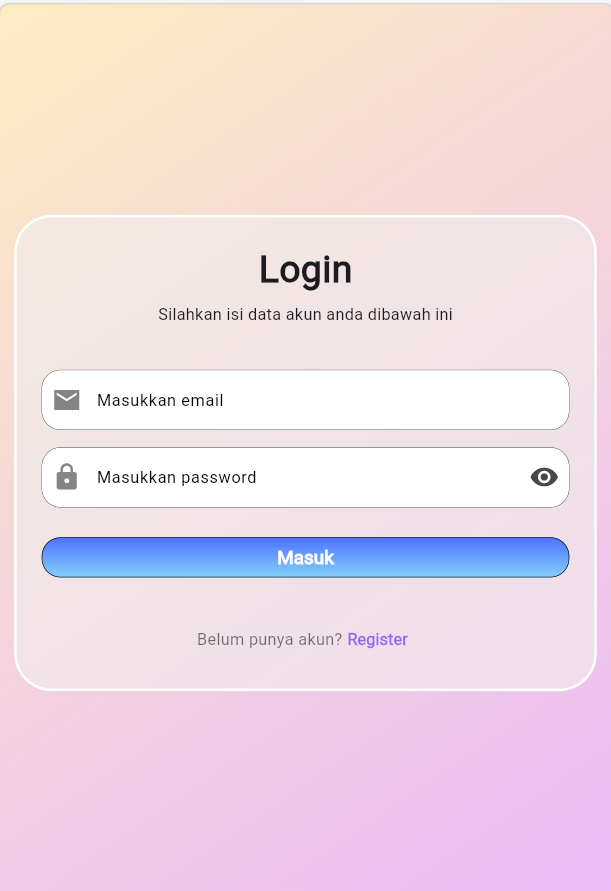
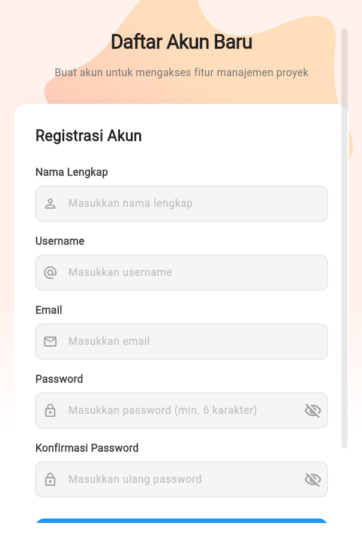
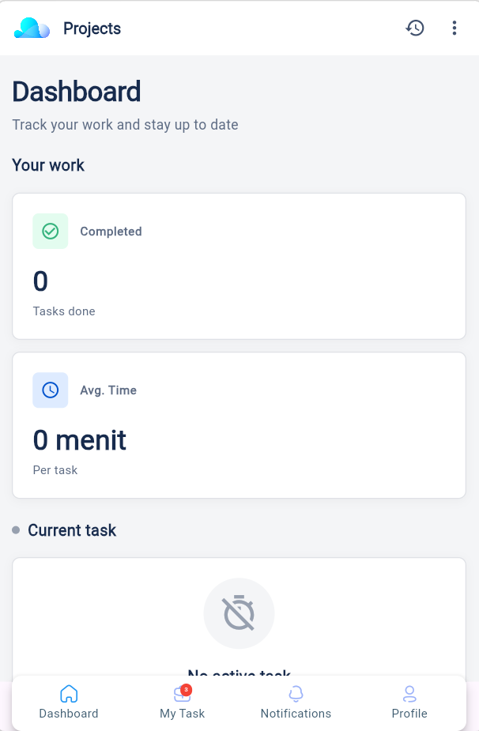
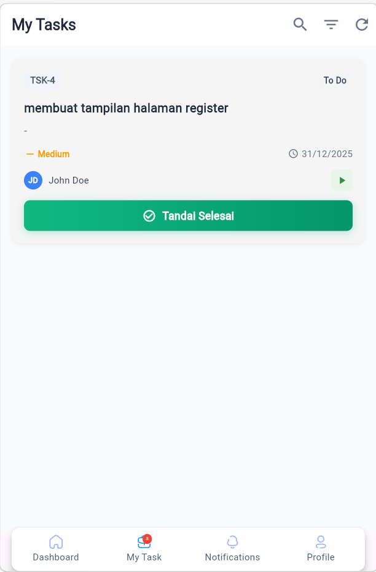
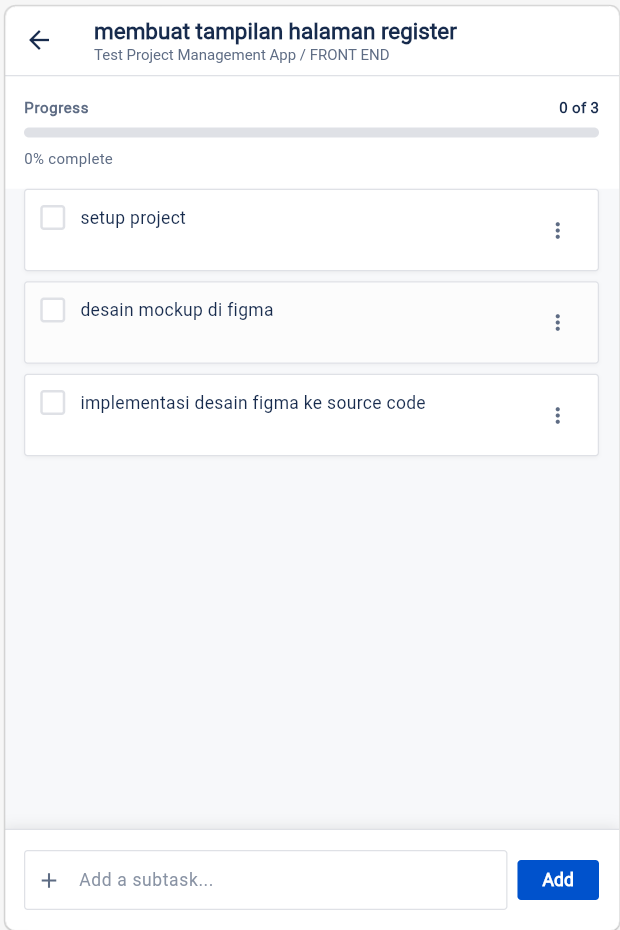
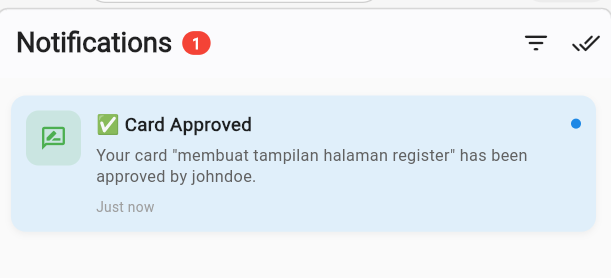
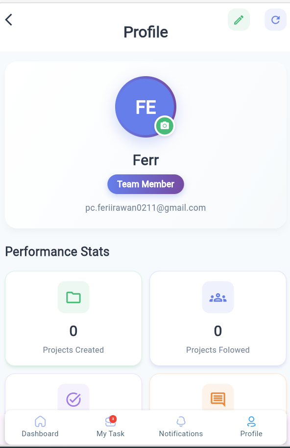

# 🚀 Project Management App (Flutter)

> Aplikasi manajemen proyek sederhana berbasis Flutter untuk membantu tim mengelola task, card, subtask, notifikasi, profil pengguna, dan pelacakan waktu kerja (time log).

---

## ✨ Tech Stack

- **Framework**: Flutter (Dart)
- **State Management**: `flutter_bloc` (Bloc & Cubit)
- **Routing**: `go_router`
- **HTTP Client**: `dio`
- **Local Storage**: `flutter_secure_storage`, `shared_preferences`
- **UI & Utility**: `project_management_widgets`, `quickalert`, `file_picker`, `flutter_image_compress`, `custom_navigation_bar`, `amicons`, `blobs`
- **Localization**: `flutter_localizations` (EN & ID)

---

## 🌟 Fitur Utama

- **Authentication**: Login, Register, dan penyimpanan token lokal.
- **Dashboard**: Ringkasan data proyek dan task untuk tampilan cepat.
- **Card Management**: Lihat, buat, ubah, hapus card (CRUD) dengan struktur board/project.
- **Task & Subtask**: Pengelolaan task detail dan checklist subtask.
- **Time Tracking**: Start/Stop timer untuk mencatat waktu kerja pada card/subtask.
- **Notification Center**: Daftar notifikasi, unread counter, mark-as-read, dan review history.
- **Profile**: Lihat & edit profil pengguna.

---

## 🧩 Struktur Model per Feature

Struktur mengikuti pola **Clean Architecture**: `data` → `domain` → `presentation`.

### 1) Authentication

- **Domain Entity**:
	- `Authentication`
- **Data Models**:
	- `AuthenticationModel`
- **Use Cases**:
	- `LoginUseCase`, `RegisterUseCase`, `GetLoginTokenUseCase`

### 2) Card

- **Domain Entities**:
	- `Card`, `Board`, `Project`, `User`, `Assignment`, `Comment`, `Subtask`
- **Data Models**:
	- `CardModel`, `BoardModel`, `ProjectModel`, `UserModel`, `AssignmentModel`, `CommentModel`, `SubtaskModel`
- **Use Cases**:
	- `GetCardsUseCase`, `CreateCardUseCase`, `UpdateCardUseCase`, `DeleteCardUseCase`

### 3) Dashboard

- **Domain Entity**:
	- `Dashboard`
- **Data Model**:
	- `DashboardModel`

### 4) Profile

- **Domain Entity**:
	- `Profile`
- **Data Models**:
	- `ProfileModel`, `UserProfileModel`

### 5) Task

- **Domain Entity**:
	- `Task`
- **Data Model**:
	- `TaskModel`

### 6) Subtask

- **Domain Layer**:
	- `SubtaskRepository`
- **Data Model**:
	- `SubtaskModel`
- **Use Cases**:
	- `GetSubtasksUseCase`, `CreateSubtaskUseCase`, `UpdateSubtaskUseCase`, `DeleteSubtaskUseCase`, `ToggleSubtaskUseCase`

### 7) Time Log

- **Domain Entity**:
	- `TimeLog`
- **Data Model**:
	- `TimeLogModel`
- **Use Cases**:
	- `StartTimeLogUseCase`, `StopTimeLogUseCase`

### 8) Notification

- **Domain Layer**:
	- `NotificationRepository`
- **Core Models (digunakan oleh fitur notification)**:
	- `NotificationModel`, `NotificationResponse`, `UnreadCountModel`

---

## 📸 Showcase / Tangkapan Layar

- Login Page: 


<br>

- Register Page: 


<br>

- Dashboard: 

|  |  |
| --- | --- |
|  | .png) |


- Task & Subtask: 

|  |  |  |
| --- | --- | --- |
|  |  |  |

<br>

- Notifications: 


- Profile: 



---

## ⚙️ Cara Instalasi

### 1. Clone Repository

```bash
git clone <url-repository-flutter>
cd project_management-app-with-flutter
```

### 2. Install Dependencies

```bash
flutter pub get
```

### 3. Konfigurasi Backend API

Pastikan backend Laravel berjalan, karena aplikasi ini memakai endpoint API pada:

```dart
http://127.0.0.1:8000/api
```

Jika perlu, ubah base URL di:

- `lib/main.dart` (inisialisasi `DioClient`)

### 4. Jalankan Aplikasi

```bash
flutter run
```

Untuk web:

```bash
flutter run -d chrome
```

---

## 📨 Penutup & Contact

Terima kasih sudah melihat project ini 🙌  
Jika ingin diskusi, kolaborasi, atau memberi masukan:

- **Nama**: Feri Irawan
- **Email**: pc.feriirawan0211@gmail.com
- **GitHub**: [https://github.com/Frzz-02](https://github.com/Frzz-02)

---

## 📌 Catatan

- Proyek ini masih bersifat sederhana/MVP dan dapat dikembangkan lebih lanjut.
- Struktur folder sudah dipisahkan per feature agar scalable untuk pengembangan berikutnya.
